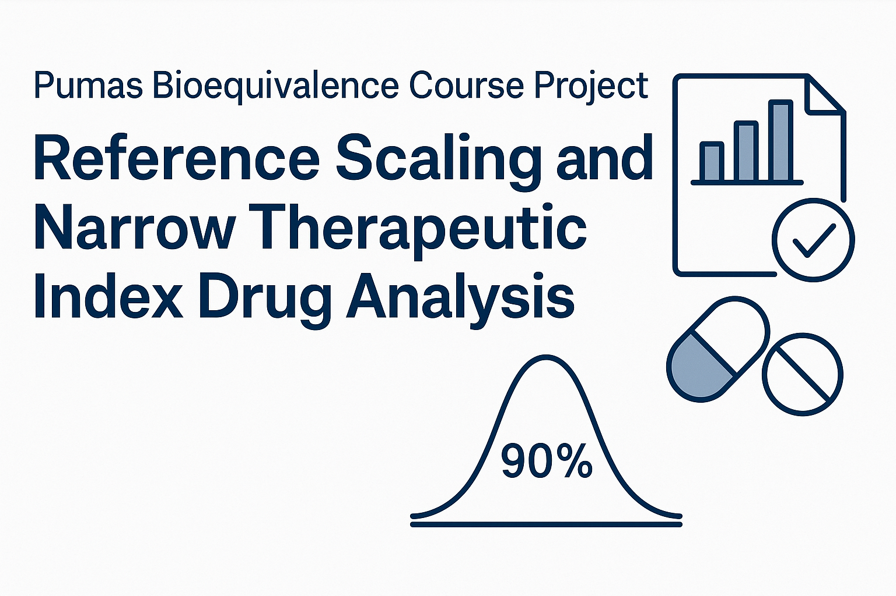

# Student Project 2 — Reference Scaling & NTID Bioequivalence Analysis


This repository contains **Student Project 2** from the *Pumas Bioequivalence Course*, focusing on:

- Standard Average Bioequivalence (ABE)
- Reference-Scaled Average Bioequivalence (RSABE)
- Narrow Therapeutic Index Drug (NTID) criteria
- Regulatory comparison (FDA vs EMA)

All analyses were performed in **Julia** using **Pumas.jl** and **Bioequivalence.jl**.



## ❓ Project Questions & Regulatory Focus

This project investigates **how regulatory bioequivalence decisions change** when drugs exhibit **high within-subject variability** or belong to the **Narrow Therapeutic Index Drug (NTID)** category.

The core questions addressed include:

- When is **standard 80–125% bioequivalence** insufficient?
- How is a **Highly Variable Drug (HVD)** identified using CVᵣ, and when is **reference scaling (RSABE)** appropriate?
- How does **FDA RSABE** differ from **EMA NTID criteria**?
- Why do NTID drugs require **tighter acceptance limits** despite reference scaling?
- How do statistical BE conclusions translate into **clinical and regulatory decisions**?

These questions are explored using **replicated crossover designs** and real datasets from *PharmaDatasets.jl*, applying FDA and EMA regulatory frameworks implemented in *Pumas.jl* and *Bioequivalence.jl*.

📄 **Detailed discussion of project questions, regulatory rationale, and learning objectives is provided in:**

- [`docs/student_project_questions.md`](docs/student_project_questions.md)


---

## 📂 Project Structure

```text
scripts/        Julia scripts to run analyses and generate figures
outputs/        Text outputs from statistical analyses
figures_project2/  Generated figures (CVr plots, forest plots, paired plots)
docs/           Markdown and PDF reports
````

## 📊 Datasets Analyzed

| Dataset        | Design                          | Endpoints     |
|----------------|----------------------------------|---------------|
| PJ2017_4_3     | Replicated crossover             | AUC, Cmax     |
| PJ2017_4_4     | Replicated crossover (HVD)       | AUC, Cmax     |
| CL2009_9_4_1   | Replicated crossover             | AUC           |

Datasets were loaded from **PharmaDatasets.jl**.

---

## 🔬 Analyses Performed

### Task 1 — Variability Assessment
- CVr and CVt estimation  
- Identification of Highly Variable Drugs (CVr ≥ 30%)  
- RSABE eligibility check  

### Task 2 — Standard Bioequivalence
- 90% CI for Test/Reference GMR  
- Pass/fail under 80–125%  

### Task 3 — FDA RSABE (HVD)
- Reference scaling for highly variable endpoints  
- Evaluation using Howe’s approximation  

### Task 4 — EMA NTID Criteria
- Narrowed acceptance interval (90–111%)  
- Comparison against FDA approach  

### Task 5 — FDA NTID RSABE
- Dual criteria:
  - RSABE statistic ≤ 0  
  - Variability ratio quantile ≤ 2.5  

---

## 📈 Visualizations

Generated figures include:
- CVr threshold plots (HVD decision support)  
- Forest plots of 90% confidence intervals  
- Paired subject plots (Test vs Reference)  

Figures are stored in `figures_project2/` and referenced in the report.

---

## 🧠 Key Findings

- **PJ2017_4_3:** Low variability → Standard ABE sufficient  
- **PJ2017_4_4:** Highly variable → RSABE appropriate, but **Cmax fails BE**  
- **CL2009_9_4_1:** HVD but fails both Standard ABE and NTID criteria  

These results illustrate **why reference scaling exists**, and **why NTID drugs remain challenging even under RSABE**.

---

## ▶️ How to Run

```bash
julia --project=. scripts/student_project_2_run_and_save.jl
```
*(Optional visualization script already executed; figures included.)*

---

## 📄 Reports

- **Markdown report:** `docs/student_project_2_report.md`  
- **Final PDF submission:** `docs/Student_Project_2_report_Montefusco.pdf`  

---

## 🧑‍🎓 Author

**Carlos Victor Montefusco Pereira**  
Pumas Bioequivalence Course
